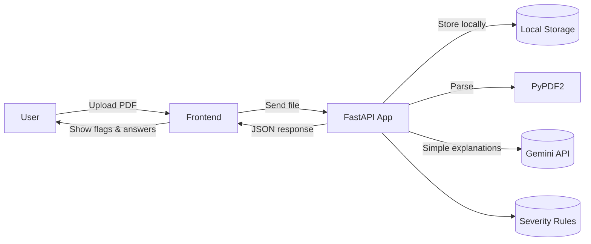

# ClauseClear – AI-Powered Legal Clause Simplifier

## Problem

Many individuals in India enter into rental agreements and loan contracts without fully understanding critical clauses such as lock-in periods, notice requirements, high security deposits, hidden fees, or arbitration clauses located in inconvenient jurisdictions. This lack of clarity can lead to unforeseen financial burdens and legal complications.

## Solution

ClauseClear is a web application designed to demystify legal contracts. Users can upload a contract PDF, and the system will provide clause-by-clause summaries in plain English, flag clauses with Green, Yellow, or Red severity indicators based on India-specific rules, and offer a Q&A feature with evidence from the document. A downloadable report with a "Not legal advice" banner is available, and user privacy is ensured through temporary storage and a "Delete Now" option.

## Key Features

*   Clause-by-clause summaries in plain English
*   Severity scoring (Green/Yellow/Red) with India-specific rules
*   Q&A with exact clause citations from the document
*   Gemini-powered 8th-grade explanations via `/query_llm/{job_id}` endpoint for simple, tenant-friendly language
*   Exportable report (PDF/HTML) for easy review
*   Privacy features: temporary storage and a user-triggered delete-now endpoint

## Architecture Overview

The backend is a FastAPI application deployed on Google Cloud Run. It uses PyPDF2 for parsing PDF documents, Google Gemini API (via REST) for generating simple explanations, and a custom Severity Engine with rule-based logic. Documents are temporarily stored in local file system (storage/uploads/). The frontend is a single-page application built with HTML, CSS, and JavaScript, providing an intuitive user interface for document uploads and result visualization.

### System Architecture



## Diagrams

For more detailed architectural and workflow diagrams, please refer to the [System Diagrams](docs/diagrams.md) document.

**Simple diagrams for non-technical readers**: see [docs/diagrams.md](docs/diagrams.md) and [docs/all_diagrams.md](docs/all_diagrams.md) for easy, visual explanations of how the app works and how Jenkins deploys it to Cloud Run.

## Documentation

*   [Detailed project report](report.md) - Comprehensive documentation of the project architecture, backend pipeline, LLM integration, and DevOps setup
*   [Architecture diagrams (Mermaid)](docs/diagrams.md) - Visual Mermaid diagrams for end-to-end flow, severity engine workflow, and CI/CD pipeline
*   [All diagrams in one place](docs/all_diagrams.md) - Complete collection of all system diagrams (simple and technical)

## Tech Stack

*   **Backend:** FastAPI, Python, Google Cloud Run, PyPDF2 (PDF parsing), Google Gemini API (REST), `scikit-learn` (for TF-IDF), MongoDB (optional).
*   **Frontend:** HTML, CSS, JavaScript (static files served by FastAPI).
*   **CI/CD:** Jenkins, Docker, Google Cloud Artifact Registry (potential for GitHub Actions integration).

## Getting Started (Local Development)

### Prerequisites

*   Python 3.11 installed
*   Node.js (for frontend dependencies if developing the static assets locally, though not strictly required for backend only)
*   Git installed

### Backend Setup

1.  **Clone the Repository:**
    ```bash
    git clone https://github.com/Yashaswini0110/PDD.git
    cd PDD
    ```
    Note: The repository root contains all files (no nested PDD/ folder).
2.  **Set up a Virtual Environment:**
    ```bash
    python -m venv .venv
    # Activate for Windows PowerShell:
    .venv\Scripts\activate
    # Activate for Linux/macOS Bash:
    # source .venv/bin/activate
    ```
3.  **Install Dependencies:**
    ```bash
    pip install -r requirements.txt
    ```
4.  **Set Environment Variables:**
    Create a `.env` file in the project root (if it doesn't exist) and add necessary environment variables:
    ```
    GEMINI_API_KEY=your_gemini_api_key_here
    MONGO_URI=mongodb://localhost:27017
    GEMINI_MODEL_NAME=gemini-2.0-flash
    ```
5.  **Run the FastAPI Server:**
    ```bash
    python -m uvicorn app:app --host 0.0.0.0 --port 5055 --reload
    ```
    The API will be accessible at `http://localhost:5055`.

### Frontend Setup

The frontend consists of static HTML, CSS, and JavaScript files located in `static/`. These are served directly by the FastAPI backend. No separate build step is required for basic local development.

To access the frontend, once the backend is running, navigate your browser to `http://localhost:5055/static/index.html` or simply `http://localhost:5055/` (which serves the index page).

## Deployment (Cloud Run + Jenkins)

This project is designed for deployment on Google Cloud Run with a Jenkins-driven CI/CD pipeline.

1.  **Docker Image Build:** A Docker image is built from the `Dockerfile` at the repository root.
2.  **Image Push:** The built Docker image is pushed to Google Cloud Artifact Registry.
3.  **Cloud Run Deployment:** A Google Cloud Run service (e.g., `clauseclear-backend`) is deployed using the image from Artifact Registry.
4.  **Jenkins Pipeline:** The Jenkins pipeline is triggered on code pushes to the repository, automating the steps: `checkout` → `docker build` → `push to Artifact Registry` → `deploy to Cloud Run`.

## Limitations & Future Work

### Current Limitations

*   **Contract Types:** Currently optimized for rental and loan contracts.
*   **Language Support:** English language contracts only.
*   **UI/UX:** Basic user interface.

### Future Work

*   Support for a wider range of contract types (e.g., employment, sales agreements).
*   Multilingual support for contract analysis.
*   Enhanced UI/UX for a more intuitive user experience.
*   Integration of advanced NLP models for more nuanced clause understanding.
*   User authentication and management features.

## Disclaimer

This tool does not provide legal advice. Always consult a qualified lawyer for legal decisions.
