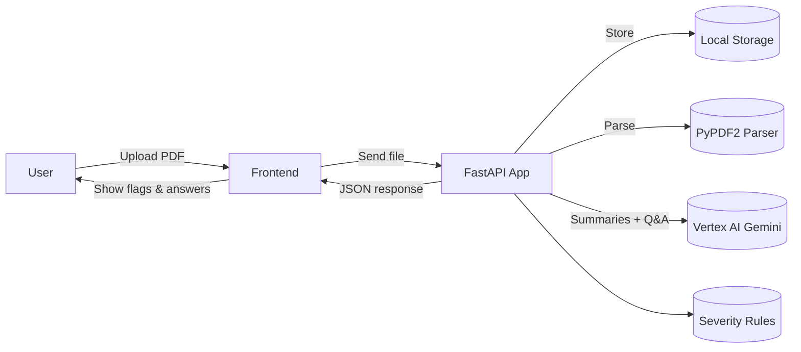

# ClauseClear – AI-Powered Legal Clause Simplifier

## Problem

Many individuals in India enter into rental agreements and loan contracts without fully understanding critical clauses such as lock-in periods, notice requirements, high security deposits, hidden fees, or arbitration clauses located in inconvenient jurisdictions. This lack of clarity can lead to unforeseen financial burdens and legal complications.

## Solution

ClauseClear is a web application designed to demystify legal contracts. Users can upload a contract PDF, and the system will analyze clauses with Green, Yellow, or Red severity indicators based on India-specific rules, and offer an interactive Q&A feature with evidence from the document.

## Key Features

*   Clause analysis with severity scoring (Green/Yellow/Red) based on India-specific rules
*   Interactive Q&A chat interface for asking questions about the contract
*   Simple, 8th-grade level explanations powered by Gemini LLM
*   Exact clause citations with page numbers for transparency
*   Risk assessment summary showing overall contract health

## Architecture Overview

The backend is a FastAPI application deployed on Google Cloud Run. It uses PyPDF2 for parsing PDF documents, Vertex AI Gemini (via API) for generating clause summaries and powering the Q&A feature, and a custom Severity Engine with rule-based logic. Documents are stored in local storage during processing. The frontend is a single-page application built with HTML, CSS, and JavaScript, providing an intuitive user interface for document uploads and result visualization.

### System Architecture



## Diagrams

For more detailed architectural and workflow diagrams, please refer to the [System Diagrams](docs/diagrams.md) document. You can also view [All Diagrams](docs/all_diagrams.md) for a comprehensive overview.

## Tech Stack

*   **Backend:** FastAPI, Python, Google Cloud Run, PyPDF2 (for PDF text extraction), Vertex AI Gemini (via API), `scikit-learn` (for TF-IDF), MongoDB (for job history).
*   **Frontend:** HTML, CSS, JavaScript (static files served by FastAPI).
*   **CI/CD:** Jenkins, Docker, Google Cloud Artifact Registry (potential for GitHub Actions integration).

## How It Works

1. PDF upload: User uploads a PDF via the frontend.
2. Text extraction: `services/parse_pdf.py` uses PyPDF2 to extract text page by page.
3. Clause splitting: `services/clauses.py` splits the text into clauses (sentences/phrases).
4. TF-IDF indexing: `services/tfidf_index.py` builds a searchable index of clauses.
5. Query processing: When a user asks a question:
   - TF-IDF finds the most relevant clauses
   - `services/severity.py` scores each clause for risk (GREEN/YELLOW/RED)
   - The LLM (`services/llm_explainer.py`) rewrites the answer in simple language
6. Response: The frontend displays the answer with risk flags and clause citations.

## Current Implementation Notes

- **PDF Parsing:** Uses PyPDF2 for text extraction. Works well for text-based PDFs; may struggle with scanned PDFs or complex layouts. Debugging logs have been added to track extracted text.
- **Storage:** Documents are temporarily stored in local storage (`storage/uploads/`) during processing.
- **Text Extraction:** The system extracts text page-by-page and splits it into clauses for analysis.

## Getting Started (Local Development)

### Prerequisites

*   Python 3.11 installed
*   Node.js (for frontend dependencies if developing the static assets locally, though not strictly required for backend only)
*   Git installed

### Backend Setup

1.  **Clone the Repository:**
    ```bash
    git clone https://github.com/Yashaswini0110/PDD.git
    cd PDD
    ```
2.  **Set up a Virtual Environment:**
    ```bash
    python -m venv .venv
    # Activate for Windows PowerShell:
    .venv\Scripts\activate
    # Activate for Linux/macOS Bash:
    # source .venv/bin/activate
    ```
3.  **Install Dependencies:**
    ```bash
    pip install -r requirements.txt
    ```
4.  **Set Environment Variables:**
    Create a `.env` file in the `PDD/` directory (if it doesn't exist) and add necessary environment variables:
    ```
    # Optional: For LLM-powered explanations (Gemini API)
    GEMINI_API_KEY=your_gemini_api_key_here
    GEMINI_MODEL_NAME=gemini-2.0-flash
    
    # Optional: For MongoDB job history storage
    MONGO_URI=your_mongodb_connection_string_here
    ```
    Note: The system will work without these variables, but LLM explanations and job history features will be disabled.
5.  **Run the FastAPI Server:**
    ```bash
    python -m uvicorn app:app --host 0.0.0.0 --port 5055 --reload
    ```
    The API will be accessible at `http://localhost:5055`.

### Frontend Setup

The frontend consists of static HTML, CSS, and JavaScript files located in `PDD/static/`. These are served directly by the FastAPI backend. No separate build step is required for basic local development.

To access the frontend, once the backend is running, navigate your browser to `http://localhost:5055/static/index.html`.

## Deployment (Cloud Run + Jenkins)

This project is designed for deployment on Google Cloud Run with a Jenkins-driven CI/CD pipeline.

1.  **Docker Image Build:** A Docker image is built from the `PDD/Dockerfile` within this repository.
2.  **Image Push:** The built Docker image is pushed to Google Cloud Artifact Registry.
3.  **Cloud Run Deployment:** A Google Cloud Run service (e.g., `clauseclear-backend`) is deployed using the image from Artifact Registry.
4.  **Jenkins Pipeline:** The Jenkins pipeline is triggered on code pushes to the repository, automating the steps: `checkout` → `docker build` → `push to Artifact Registry` → `deploy to Cloud Run`.

## Limitations & Future Work

### Current Limitations

*   **Contract Types:** Currently optimized for rental and loan contracts.
*   **Language Support:** English language contracts only.
*   **UI/UX:** Basic user interface.

### Future Work

*   Support for a wider range of contract types (e.g., employment, sales agreements).
*   Multilingual support for contract analysis.
*   Enhanced UI/UX for a more intuitive user experience.
*   Integration of advanced NLP models for more nuanced clause understanding.
*   User authentication and management features.

## Disclaimer

This tool does not provide legal advice. Always consult a qualified lawyer for legal decisions.
