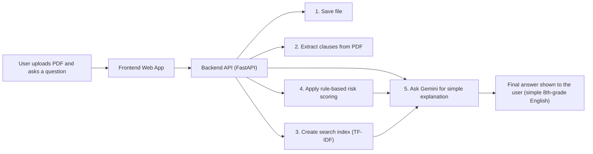
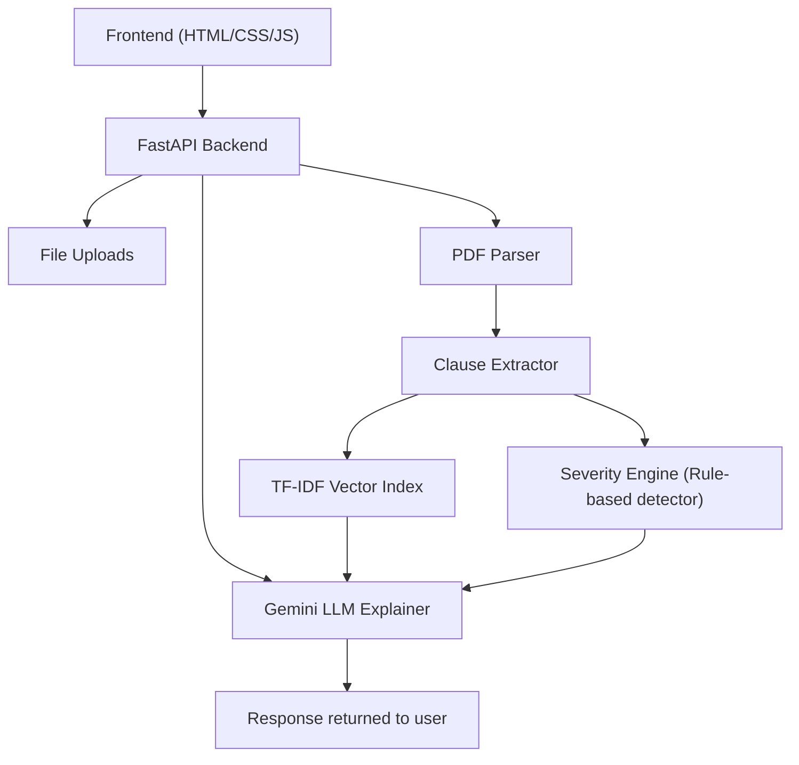
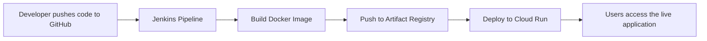
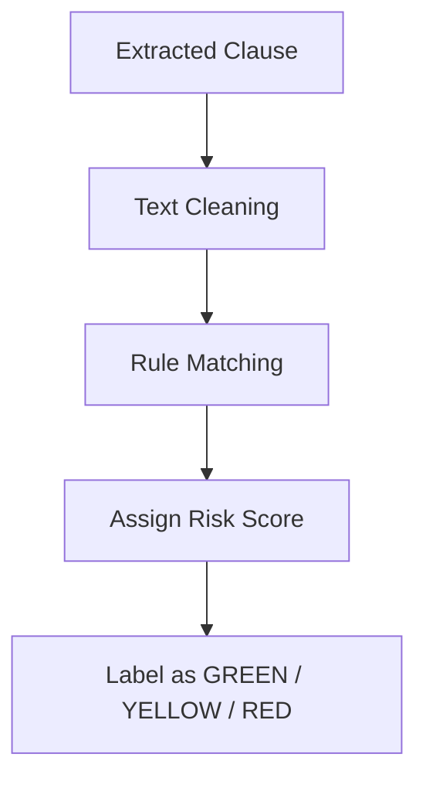
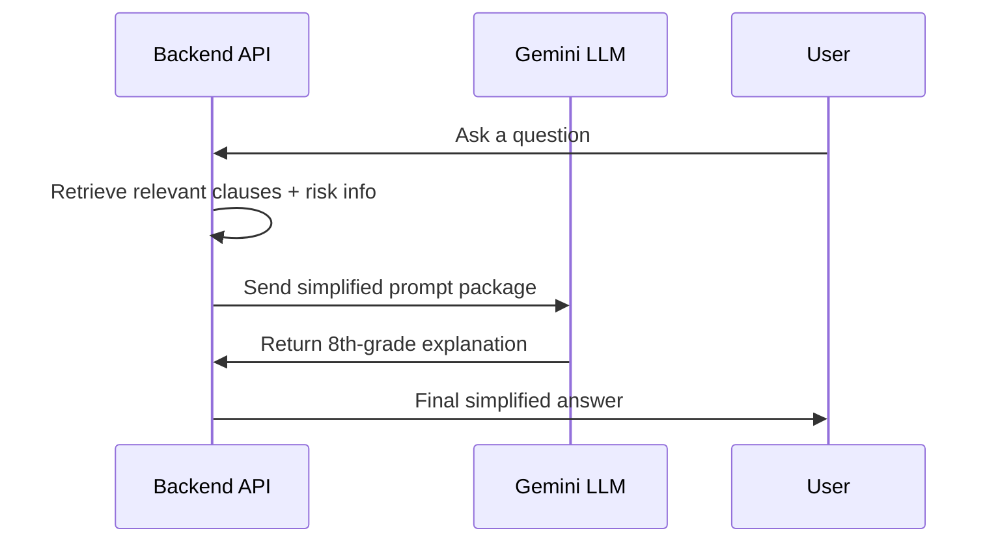

# ClauseClear – All System Diagrams (For Easy Sharing)

## 1. Simple Application Workflow (Easy for Everyone)

This diagram shows what happens when a user uploads a rental agreement PDF and asks questions about it.

## 2. Backend Architecture (Technical Overview)

This diagram shows the technical components and how they interact.

## 3. CI/CD Pipeline (Jenkins → Artifact Registry → Cloud Run)

This diagram shows how code changes are automatically deployed to production.

## 4. Severity Engine Workflow

This diagram shows how the system analyzes clauses to assign risk levels (GREEN/YELLOW/RED).

## 5. LLM Explanation Layer (Gemini)

This sequence diagram shows how the system uses Gemini to convert technical explanations into simple language.

