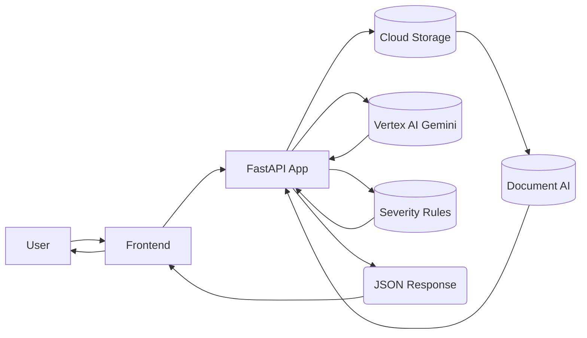

# System Diagrams

This document provides visual explanations of the ClauseClear system's key workflows and architecture using Mermaid diagrams.

## 1. End-to-End Pipeline

This diagram illustrates the complete flow of a document through the ClauseClear system, from user upload to the final flagged and answered report presented back to the user. It highlights the interaction between the frontend, backend services, and external Google Cloud components.



## 2. Severity Engine Workflow

The Severity Engine is responsible for evaluating extracted clauses against India-specific rules to assign a risk level (Green, Yellow, or Red). This diagram details the internal process, including rule matching and reasoning generation.

```mermaid
graph TD
    A[Input Clauses] --> B{Rule Matching (Regex/Heuristics)}
    B --> C{Optional LLM Extraction}
    C --> D[Assign Green/Yellow/Red + Reason]
    D --> E[Output Risk Summary]
```

## 3. CI/CD (GitHub + Jenkins + Cloud Run)

This diagram outlines the continuous integration and continuous deployment pipeline. It shows how code changes are pushed by a developer, processed by GitHub, trigger a Jenkins pipeline, and ultimately lead to an updated service running on Google Cloud Run.

```mermaid
flowchart LR
    Developer --> |Push Code| GitHub
    GitHub --> |Webhook Trigger| Jenkins[Jenkins Pipeline]
    Jenkins --> |Checkout Repo| Jenkins
    Jenkins --> |Docker Build| Jenkins
    Jenkins --> |Push Image| ArtifactRegistry[(Artifact Registry)]
    ArtifactRegistry --> |Deploy Service| CloudRun[(Cloud Run)]
    CloudRun --> ServiceLive(Updated Service Live)