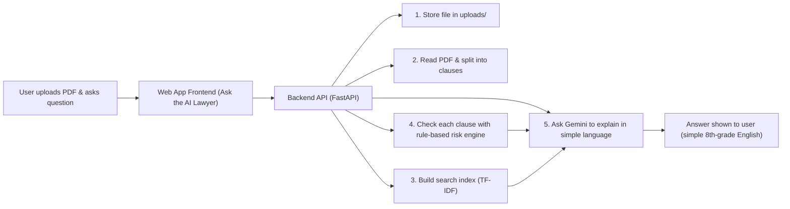
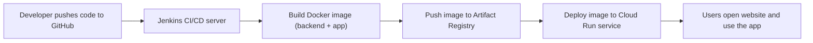
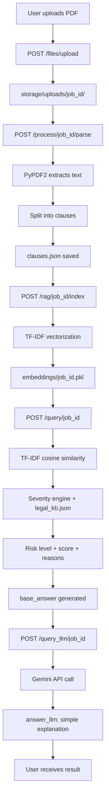
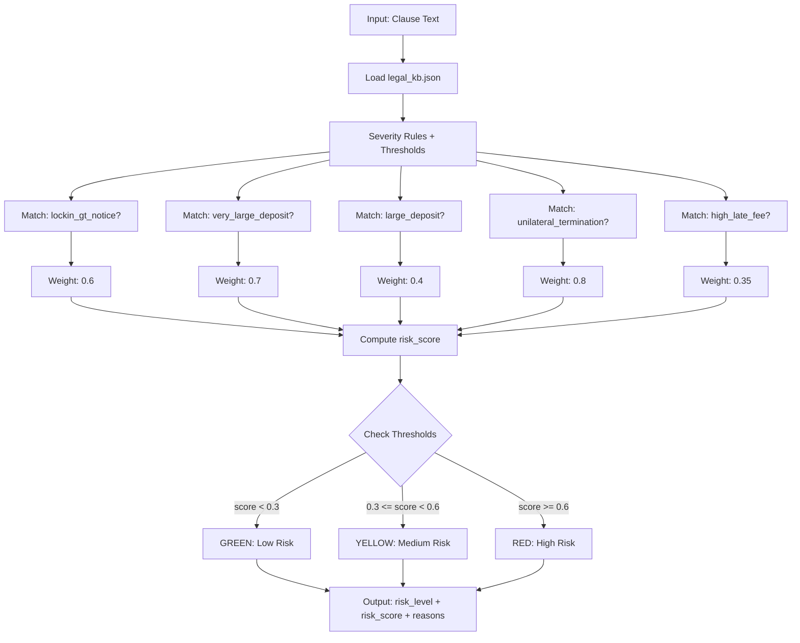

# System Diagrams

This document provides visual explanations of the ClauseClear system's key workflows and architecture using Mermaid diagrams.

## Simple App Workflow (for non-technical users)

This diagram shows what happens when a user uploads a rental agreement PDF and asks questions about it.

## How the Code Goes Live (Jenkins + Cloud Run)

This diagram shows how our code goes from GitHub → Jenkins → Google Cloud Run.

## End-to-End Flow (User → Backend → LLM → Result)

This diagram shows the complete flow from user upload through PDF parsing, clause extraction, indexing, querying, and LLM-powered explanation.

The flow starts with PDF upload, extracts text using PyPDF2, splits into clauses, builds a TF-IDF index for semantic search, scores clauses for risk using India-specific rules, and optionally uses Gemini to rewrite explanations in simple language.

## Severity Engine Workflow

This diagram details how the rule-based severity engine analyzes clauses against India-specific rules to assign risk levels.

The severity engine loads rules from legal_kb.json, matches patterns in clause text (security deposits, lock-in periods, termination clauses, etc.), applies weighted scoring, and maps the final score to GREEN/YELLOW/RED risk levels with explanatory reasons.

## CI/CD Pipeline (Jenkins → Artifact Registry → Cloud Run)

This diagram shows the automated deployment pipeline from code push to Cloud Run service deployment.

```mermaid
flowchart LR
    Developer[Developer] -->|Push to GitHub| GitHub[GitHub Repository]
    GitHub -->|Webhook/Manual Trigger| Jenkins[Jenkins Pipeline]
    Jenkins --> Stage1[Stage 1: Checkout]
    Stage1 --> Stage2[Stage 2: Docker Build]
    Stage2 --> Stage3[Stage 3: Push to Artifact Registry]
    Stage3 --> Auth[GCP Service Account Auth]
    Auth --> ArtifactReg[us-central1-docker.pkg.dev/productdesigndev/clauseclear/clauseclear-backend]
    ArtifactReg --> Stage4[Stage 4: Deploy to Cloud Run]
    Stage4 --> EnvVars[Inject Env Vars: GEMINI_API_KEY, MONGO_URI, GEMINI_MODEL_NAME]
    EnvVars --> CloudRun[Cloud Run Service: clauseclear-backend]
    CloudRun --> Users[Users access service]
```

The Jenkins pipeline checks out code, builds a Docker image, pushes it to GCP Artifact Registry, and deploys to Cloud Run with environment variables injected from Jenkins credentials. The service is then live and accessible to users.
