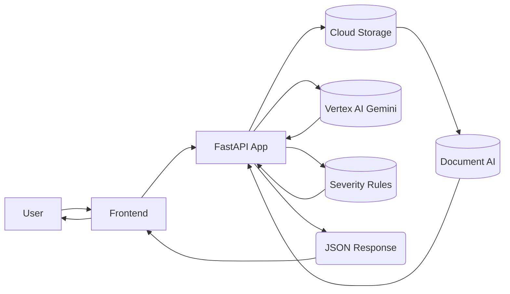

# ClauseClear – Internal Technical Report

## 1. Problem & Motivation

In India, many individuals frequently encounter and sign critical legal documents like rental agreements and loan contracts without a complete understanding of their clauses. This lack of comprehension often leads to significant issues, such as being unaware of stringent lock-in periods versus flexible notice clauses, unexpectedly high security deposits, hidden processing or foreclosure fees, or arbitration clauses that mandate dispute resolution in distant, inconvenient venues.

These unaddressed ambiguities can result in severe financial distress and unforeseen legal entanglements for the signees. There is a clear need for tools that can bridge this knowledge gap, empowering individuals to make informed decisions before committing to legal agreements.

The motivation behind ClauseClear is to address these pressing issues by providing transparent, plain-language explanations and clear risk warnings. By simplifying complex legal jargon and highlighting potential pitfalls, ClauseClear aims to protect individuals from adverse contractual obligations, fostering greater fairness and understanding in legal dealings.

## 2. High-Level Solution

ClauseClear offers a streamlined solution: users upload a PDF contract, which is then parsed using Google Cloud Document AI to extract raw text. This text is subsequently broken down into manageable clauses. Vertex AI Gemini then summarizes these clauses into plain English and powers a comprehensive Q&A feature. Concurrently, a rule-based Severity Engine analyzes the clauses for India-specific risks, assigning Green, Yellow, or Red flags. Users can interact with the document through Q&A, receiving answers with exact clause citations, and finally export a detailed report. All uploaded files are subject to an auto-delete policy to ensure privacy.

## 3. System Architecture

The ClauseClear system comprises a Python-based backend service, a static frontend web application, and several integrated Google Cloud Platform (GCP) services. The backend, built with FastAPI, handles all core logic, while the frontend provides the user interface for interaction. GCP services provide the necessary infrastructure for document processing, AI capabilities, and data storage.

### System Architecture

### 3.1 Backend (FastAPI Service)

The backend is a FastAPI application (`PDD/app.py`) responsible for orchestrating the entire document analysis pipeline. It exposes RESTful APIs for file uploads, document parsing, index building, severity analysis, and Q&A. Key modules include `PDD/services/parse_pdf.py` for PDF handling, `PDD/services/tfidf_index.py` for retrieval, and `PDD/services/severity.py` for risk assessment.

### 3.2 Frontend (React Web App)

The frontend is a collection of static HTML, CSS, and JavaScript files located in the `PDD/static/` directory. These files provide the user interface for uploading documents, displaying clause summaries, severity flags, Q&A results, and generating reports. Although currently served as static assets, this architecture allows for future migration to a more dynamic framework like React.

### 3.3 Google Cloud Services (Cloud Run, Artifact Registry, GCS, Document AI, Vertex AI)

ClauseClear leverages several GCP services for scalability, AI capabilities, and robust data handling:
*   **Cloud Run:** Hosts the FastAPI backend as a serverless containerized service.
*   **Artifact Registry:** Stores Docker images of the backend for deployment.
*   **Cloud Storage (GCS):** Used for temporary storage of uploaded PDF documents.
*   **Document AI:** Processes PDF documents to extract text and structure.
*   **Vertex AI (Gemini):** Provides advanced natural language processing for summarization and intelligent Q&A.

## 4. Codebase Overview

The codebase is organized within the `PDD/` directory, following a modular structure.

*   **Backend entrypoint and main modules:**
    *   [`PDD/app.py`](PDD/app.py): The main FastAPI application entry point, defining API routes and coordinating service calls.
    *   [`PDD/services/db.py`](PDD/services/db.py): Handles database interactions (likely SQLite for local, or a more robust solution in cloud).
    *   [`PDD/services/parse_pdf.py`](PDD/services/parse_pdf.py): Contains logic for parsing PDF files and extracting text.
    *   [`PDD/services/clauses.py`](PDD/services/clauses.py): Manages the segmentation and processing of extracted text into individual clauses.
*   **Severity engine module(s):**
    *   [`PDD/services/severity.py`](PDD/services/severity.py): Implements the rule-based logic for assessing the risk level (Green/Yellow/Red) of clauses based on predefined criteria, often specific to Indian legal contexts.
    *   [`PDD/knowledge/legal_kb.json`](PDD/knowledge/legal_kb.json): Contains the knowledge base and rules used by the severity engine.
*   **Q&A / retrieval component:**
    *   [`PDD/services/tfidf_index.py`](PDD/services/tfidf_index.py): Implements TF-IDF (Term Frequency-Inverse Document Frequency) for creating a searchable index of clauses, enabling efficient semantic search and retrieval for the Q&A feature.
    *   [`PDD/services/kb_loader.py`](PDD/services/kb_loader.py): Responsible for loading and managing the knowledge base.
*   **Frontend main components:**
    *   [`PDD/static/index.html`](PDD/static/index.html): The main entry point for the web application.
    *   [`PDD/static/css/style.css`](PDD/static/css/style.css): Defines the styling and visual presentation of the frontend.
    *   [`PDD/static/js/firebase-config.js`](PDD/static/js/firebase-config.js): Likely contains Firebase configuration for client-side functionality (e.g., authentication, analytics).
*   **Config/infra files:**
    *   [`PDD/Dockerfile`](PDD/Dockerfile): Defines the Docker image for containerizing the FastAPI backend.
    *   [`PDD/Jenkinsfile`](PDD/Jenkinsfile): Specifies the Jenkins pipeline for continuous integration and deployment.
    *   [`PDD/.github/`](PDD/.github/): Directory for GitHub Actions workflows, potentially used for additional CI tasks.
    *   [`PDD/requirements.txt`](PDD/requirements.txt): Lists all Python dependencies for the backend.

## 5. Core Logic

### 5.1 Clause Extraction & Preprocessing

The document parsing process begins with uploading a PDF, which is then processed by Google Cloud Document AI to extract raw text and potentially structural information. This raw text is then passed to internal services (likely `PDD/services/parse_pdf.py` and `PDD/services/clauses.py`) which are responsible for segmenting the document into discrete, meaningful clauses. This involves identifying paragraph breaks, headings, and other structural cues to ensure accurate clause separation.

### 5.2 Summarization

Vertex AI Gemini is utilized to generate concise, plain-English summaries for each extracted clause. The backend sends the extracted clause text to the Gemini API, which then applies its natural language understanding capabilities to condense the information, making complex legal terminology accessible to a non-expert audience.

### 5.3 Severity Scoring

The Severity Engine (`PDD/services/severity.py`) evaluates each clause against a set of predefined, India-specific legal rules and heuristics, loaded from [`PDD/knowledge/legal_kb.json`](PDD/knowledge/legal_kb.json). These rules identify potential issues such as lock-in periods not matching notice periods, excessively high security deposits, hidden late fees, or arbitration clauses that mandate inconvenient venues. The process involves regex matching, keyword detection, and potentially optional LLM extraction to understand context, ultimately assigning a Green (low risk), Yellow (medium risk), or Red (high risk) flag along with a human-readable reason for the score.

### 5.4 Q&A with Citations

The Q&A functionality operates exclusively over the extracted clauses. When a user poses a question, the system uses TF-IDF similarity (`PDD/services/tfidf_index.py`) to find the most relevant clauses within the document. Vertex AI Gemini then generates an answer based on these identified clauses. Critically, the system returns not only the answer but also the exact text snippet or citation from the original clause, providing evidence for the answer. If no confident match is found, the system gracefully responds with "UNKNOWN."

## 6. Deployment: Google Cloud & Cloud Run

The ClauseClear backend is designed for serverless deployment on Google Cloud Run.

*   **Docker Image:** A Docker image is built from the `PDD/Dockerfile` and tagged with a pattern such as `${REGION}-docker.pkg.dev/${PROJECT_ID}/${REPO_NAME}/${SERVICE_NAME}`. This image contains all necessary dependencies and the FastAPI application.
*   **Cloud Run Service Configuration:** The `clauseclear-backend` Cloud Run service is configured with this container image. Key configurations typically include:
    *   **Container Image:** Path to the image in Artifact Registry.
    *   **Region:** The GCP region where the service is deployed.
    *   **Environment Variables:** Names like `GOOGLE_APPLICATION_CREDENTIALS` (referencing a mounted service account key), `GCS_BUCKET_NAME`, `GEMINI_MODEL_NAME`, etc. (values are securely managed).
    *   **Concurrency:** Maximum number of requests a single container instance can handle simultaneously.
    *   **CPU Allocation:** CPU resources assigned per instance.
*   **Google Cloud Storage (GCS):** GCS is used for temporary storage of uploaded PDF files. A lifecycle policy is configured on the GCS bucket to automatically delete files after a predefined period (e.g., 24 hours), ensuring user data privacy and optimizing storage costs.
*   **Document AI and Vertex AI Integration:** These services are enabled via their respective GCP APIs. The backend authenticates and interacts with them using service account credentials, allowing it to leverage their capabilities for parsing and AI-driven summarization/Q&A.

## 7. CI/CD: GitHub + Jenkins Pipeline

The project utilizes a Jenkins-driven CI/CD pipeline to automate the build, test, and deployment process, initiated by code pushes to GitHub.

*   **Jenkins Pipeline Stages:** The `PDD/Jenkinsfile` defines the following high-level stages:
    *   **Checkout:** Fetches the latest code from the GitHub repository.
    *   **Docker Build:** Builds the Docker image for the FastAPI backend using the `PDD/Dockerfile`.
    *   **Authenticate with GCP:** Authenticates with Google Cloud Platform using a service account JSON credential. This credential is securely stored and provided to Jenkins.
    *   **Push Image to Artifact Registry:** Pushes the newly built Docker image to the configured Google Cloud Artifact Registry.
    *   **Deploy to Cloud Run:** Deploys the updated service to Google Cloud Run, pointing to the new image in Artifact Registry.
*   **Service Account Roles:** The GCP service account used for Jenkins authentication has roles such as `Cloud Run Admin` (to manage Cloud Run services) and `Artifact Registry Writer` (to push images to Artifact Registry). This ensures Jenkins has the necessary permissions without exposing sensitive project-level access.
*   **GitHub Integration:** GitHub serves as the source code repository. Webhooks are configured to trigger the Jenkins pipeline automatically upon code pushes to specific branches, ensuring continuous integration and deployment.

## 8. How to Run Locally (Developer Guide)

To set up and run the ClauseClear backend locally for development:

1.  **Clone the Repository:** `git clone https://github.com/Yashaswini0110/PDD.git && cd PDD`
2.  **Create & Activate Virtual Environment:** `python -m venv .venv` followed by `.\.venv\Scripts\activate` (Windows PowerShell) or `source .venv/bin/activate` (Linux/macOS).
3.  **Install Dependencies:** `pip install -r requirements.txt`
4.  **Set Environment Variables:** Create a `.env` file in the `PDD/` directory with necessary GCP service account path (e.g., `GOOGLE_APPLICATION_CREDENTIALS=/path/to/your/service-account-key.json`).
5.  **Run Backend:** `python -m uvicorn app:app --host 0.0.0.0 --port 5055 --reload`
The frontend static files can be accessed via `http://localhost:5055/static/index.html` once the backend is running.

## 9. Known Issues & Next Steps

*   **Error Handling:** Improve robustness of error handling across all API endpoints and internal services.
*   **PDF Variety:** Enhance parsing capabilities to better handle diverse and potentially messy PDF layouts and structures.
*   **Severity Rules:** Expand and refine the India-specific severity rules in `PDD/knowledge/legal_kb.json` to cover more edge cases and legal nuances.
*   **Frontend Polish:** Significant UI/UX improvements are needed for a more intuitive and visually appealing user experience.
*   **Test Suite:** Develop a comprehensive test suite (unit, integration, and end-to-end tests) to ensure reliability and prevent regressions.
*   **Scalability:** Optimize database and AI service calls for higher throughput and lower latency under load.

## 10. Notes for Formal Report / Paper

The following sections and concepts from this internal technical report can be directly reused or expanded upon for a more formal academic or technical paper:

*   **Problem Statement:** Detailed description of the challenges faced by individuals in India with legal contracts.
*   **System Architecture:** The high-level architecture overview and the Mermaid diagram.
*   **Design of Severity Engine:** In-depth explanation of the rule-based approach, India-specific rules, and the integration of optional LLM extraction.
*   **Privacy Considerations:** Discussion on temporary storage, auto-deletion, and user control over data.
*   **Limitations and Future Scope:** Current constraints and the roadmap for future enhancements.